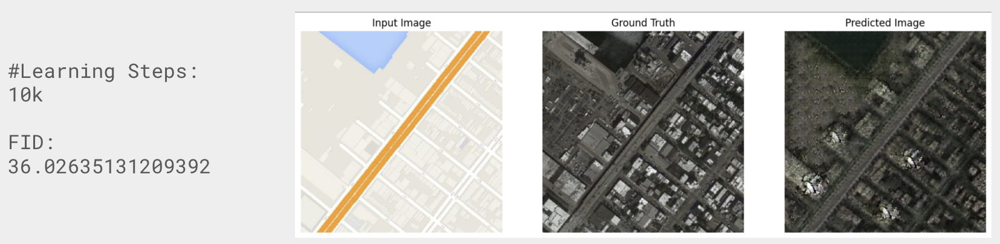
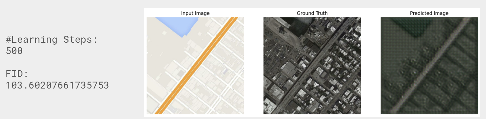
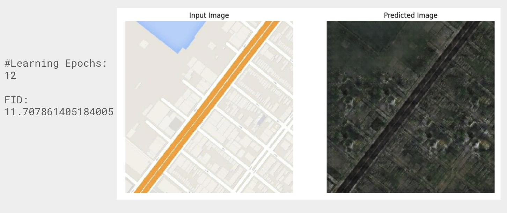

# Image-to-Image Translation with Conditional GANs
`Hesam Korki, Mina Naseh`

### Metrics to Evaluate GANs
- We wanted to know how our changes affect the quality of the generated images
- GANs are adversarial networks i.e. they use a special type of loss function that both generator and discriminator try to optimize
- However, the final quality of our output only depends on the generator. So evaluation is not straightforward
- There are  24 ways of evaluating GANs according to [this paper](https://arxiv.org/pdf/1802.03446.pdf)

### Fréchet Inception Distance (FID)
- Introduced in 2017 and still widely adopted
- It has been shown that FID is consistent with human judgments and is more robust to noise than IS (Inception Score)
- Generated samples move into a feature space with Inception Net (or any CNN). Viewing the embeddings as a continuous multivariate Gaussian, the mean and covariance are estimated for both the generated data and the real data. Then FID is the distance between the real distribution and the generated one

### Step Comparison in pix2pix model

We can see that letting the network train for more steps generates more realistic results (as expected) and the FID [*Lower better*] attests to this.

### CycleGAN
We also used [CycleGAN](https://www.tensorflow.org/tutorials/generative/cyclegan) to train on maps dataset, and we got a better FID with this method. CycleGAN is constructed based on [Pix2Pix](https://www.tensorflow.org/tutorials/generative/pix2pix). It uses an additional loss function named cycle consistency loss which makes it able to train without paired data.

